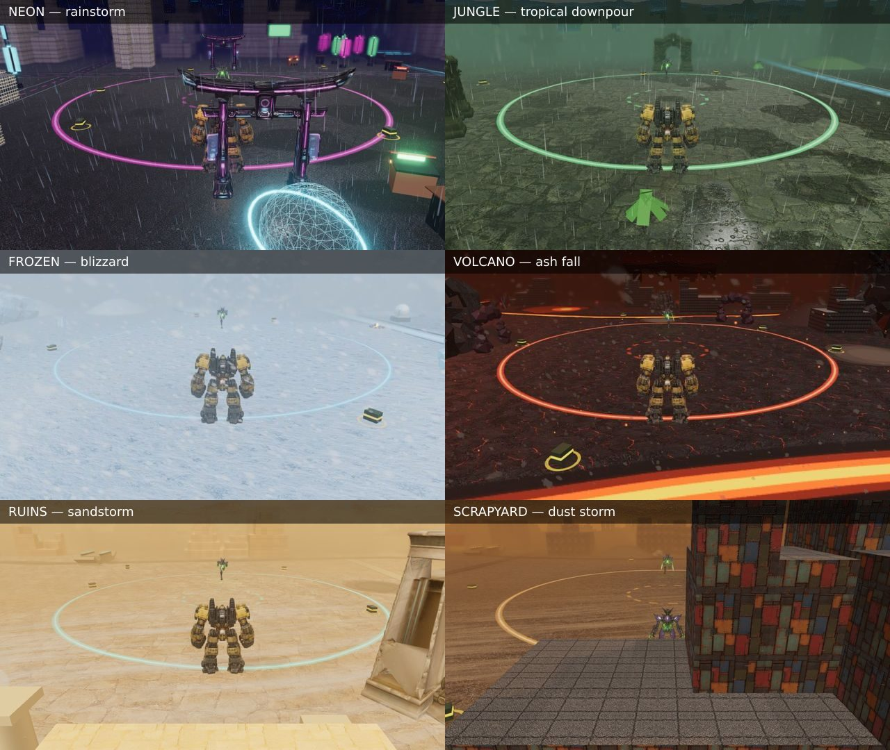

# WEATHER — rain, snow, ash and sandstorms

Seven of the twelve arenas now have weather: rain over the night city and the
jungle, snow at the frozen outpost, ash over the volcano and the foundry, and
occasional sandstorms in the desert ruins and the scrapyard. It varies from a
drizzle to a storm during a round, it gusts, and it is purely visual. Nothing
that decides a fight reads it.

Code: `src/arena/climate.js` (which boards, and how the weather behaves over
time), `src/arena/weather.js` (everything you see), the volume term in
`src/core/hazeblur.js`, wetness in `src/arena/groundshader.js`, and
`weatherSound` in `src/core/audio.js`. The settings menu has
**WEATHER: ON/OFF**.

---

## 1 · Only where it makes sense

The sky behind every arena is a painted picture. Weather that contradicts it
reads as a bug: rain falling out of a clear blue sky, for example. So a board
gets weather only when its sky, its light and its setting can carry it.

| arena | weather | why |
|---|---|---|
| **neon** | rain, drizzle → downpour, lightning when heavy | a midnight city under cloud, and its recorded ambient bed was already rain. It rains in 85% of rounds. |
| **jungle** | tropical rain: lulls broken by sudden downpours | a misty, overcast rainforest sky. Rains in 72% of rounds. |
| **frozen** | snow, flurries → blizzard, hard gusts | a polar outpost whose bed is already a blizzard. Snows in 92% of rounds. |
| **volcano** | ash, always, thicker in bursts, plus embers | a live caldera. Ash is what falls there. |
| **foundry** | a light fall of soot, some rounds | smokestacks under an orange smoggy sky. Stays light. 55% of rounds. |
| **ruins** | dust: calm air, then occasional **sandstorms** | open desert. Storms roll in, hold and blow through, 0–2 in a ten-minute run. |
| **scrapyard** | dust: rust-brown storms, less often | a dusty yard under a golden-hour sky. |
| uptown | none | clear blue sky and bright sun |
| skyterrace | none | above the cloud deck: nothing to fall from |
| harbor | none | a sunset harbour; rain under that sky looks wrong |
| quarry | none | a clear, starlit crystal pit |
| orbital | none | a space station |

## 2 · How it behaves over time (`climate.js`)

Intensity `k` (0–1) means the same thing for every kind: about 0.1 is a
drizzle, a few flakes, a dusting of ash or sand snaking along the ground; 1 is
a rainstorm, a blizzard, an ash storm or a wall of dust. Three regimes move it:

- **wander** (neon, frozen, volcano, foundry): a new target every 14–36 s,
  approached over ~10 s. The weather drifts between drizzle and downpour.
- **bursty** (jungle): lulls of 14–32 s broken by 7–16 s downpours that
  arrive in ~5 s and ease off more slowly.
- **events** (ruins, scrapyard): calm air (sand streamers only), then a storm
  that builds over ~11 s, holds 10–26 s while breathing a little, and blows
  through. Never in the opening seconds of a round.

**Gusts** sit on top of the level. They are discrete events (a 0.35–1.1 s
rise, an optional hold, a 1.4–3.8 s decay, overlapping), plus a fast flutter.
They raise the wind speed, veer its heading and briefly thicken whatever is
falling. Stormier weather gusts more often. Each round opens somewhere inside
its climate rather than always at the floor, and rain that has been falling a
while has already wet the ground.

`test/weather.test.mjs` runs ten-minute matches of every climate in Node. It
checks that intensity stays in range and actually moves through it, that
sandstorms are occasional, that jungle rain comes in bursts, that the wind
gusts, that the same seed gives the same weather, and that the five clear-sky
arenas have none.

## 3 · What you see (`weather.js`)

"Realistic, not simplified particles" came down to five decisions:

1. **Rain is a motion-blurred streak, not a dot.** Each drop is a quad from
   its head back along its own velocity over a camera exposure. It is a
   teardrop: full width at the head, tapering up the tail, and fading out
   along it. It is never drawn thinner than a pixel; a drop thinner than
   that is drawn fainter instead, which stops a field of thin lines
   aliasing into noise. Drizzle is fine drops falling slowly; a storm is big
   drops at terminal velocity, so streaks lengthen as it builds. Drops vary in
   brightness, and on neon some catch the pink and cyan signage.
2. **Intensity changes how many, not how bright.** Every instance has a rank
   and draws only while its rank is under the current density, so a drizzle
   thickening into a storm adds drops. Wind-advected **sheets** make the
   density uneven, which is what gusting rain actually looks like.
3. **Everything moves with ONE integrated offset** (∫ velocity dt). A gust
   that changes the wind never makes a drop jump, and the CPU does nothing
   per drop. The drops wrap through a box that follows whichever camera is
   drawing. A near box and a wide sparse box give depth, and it works in every
   split view, the finisher cameras and the loading card.
4. **The weather volume.** The distance-haze pass already has the scene's
   depth, so it raymarches a short way (10 jittered steps) through
   wind-advected noise up to that depth. Rain sheets, dust clouds, a
   whiteout or an ash haze roll *through* the arena, hide what is behind
   them, and are occluded by whatever stands in front. Dust hugs the ground,
   and in the sun's direction it glows (forward scatter).
5. **The world reacts.**
   - **Wet ground:** darker as water fills the pores, glossier, and flatter
     (water smooths the surface, which also stops a glossy floor glittering).
     Puddles stand in the low ground of the relief, near-mirror flat, with
     rain rings in them.
   - **Buildings and road markings** gloss up as it rains.
   - **Splashes:** a crown of droplets and a ripple ring land on the relief.
     They are positioned from a texture of the same height grid physics uses.
   - **Ground streamers:** sand (and snow in a blizzard) streams along the
     ground as three stacked sheets of wispy, snaking streaks racing at wind
     speed. A single lit grain over sand-coloured ground has no contrast;
     this is what blowing sand actually looks like up close.
   - **The sky:** fog pulls in and tints toward the storm, and a veil covers
     the painted sky (a sandstorm has no blue sky). The sun dims. In a heavy
     rainstorm, **lightning**: a forked bolt in the distance, the scene
     flashing in 2–3 pulses, and thunder after a delay set by how far away
     the bolt was (sound travels ~340 m/s).

**Sound** follows the same numbers, over the arena's recorded bed. It is
synthesized rain (a hiss, plus a low roar under a downpour), wind whose pitch
rises in a gust with a whistle when it really blows, and a dry sand hiss. It
runs on its own bus after the combat compressor, so a punch does not make the
rain duck. It is a dead man's switch: every frame re-arms a fade to silence,
so pausing, leaving or swapping the arena quiets it by itself.

### Kept playable

A sandstorm at full strength still lets you see the opponent ~40 units away
as a silhouette. An earlier tuning hid him at 35 units, which looked great
and played badly. Fog never closes below ~25% of its normal near distance.
Weather never touches physics, AI, hit tests or camera. **WEATHER: OFF** in
the settings switches it off on the next frame and gives the arena its own
fog, light and dry ground back (`tools/scratch/weathersplit.mjs` asserts it).

## 4 · Cost

Per view, rain is five draw calls (six during a lightning strike): two drop
layers, two splash layers, the veil and the bolt. Snow, ash and dust are
three or four. Every drop is
positioned on the GPU from uniforms. The volume adds ten noise samples per
pixel in a pass that already runs. Split screen with post FX dropped keeps
everything but the volume, and the fog and veil carry the storm alone there.

## 5 · Knobs and tools

- `?weather=0|off` · `on` · `force` (every round of a board with a climate) ·
  `rain|snow|ash|dust` (that kind on ANY arena, a dev switch).
  `?weatherk=0..1` pins the intensity.
- `node tools/weathershot.mjs <theme> <out> [--k 0.15,0.5,1] [--strike]`
  captures the real chase camera through the real post chain at pinned
  intensities. Precipitation is **geometry**, so unlike the particle pools it
  renders under SwiftShader, and these pictures are evidence.
- `node tools/scratch/weathersplit.mjs <out>` checks split screen and the live
  toggle restoring fog, light and dry ground.
- `node tools/scratch/weatheraudio.mjs` checks the sound: silent with no
  weather, drizzle ~19 dB under a storm, and silent within a second of the
  updates stopping.
- `node tools/scratch/arenaswap.mjs` (now run with weather forced) checks the
  old arena's weather leaves with it on a round swap.

One trap worth knowing: a falling streak runs tail → head *down* the screen,
which flips the quad's winding. Single-sided, every drop was culled as a back
face. The draw call ran and drew nothing. Every weather quad is double-sided.
